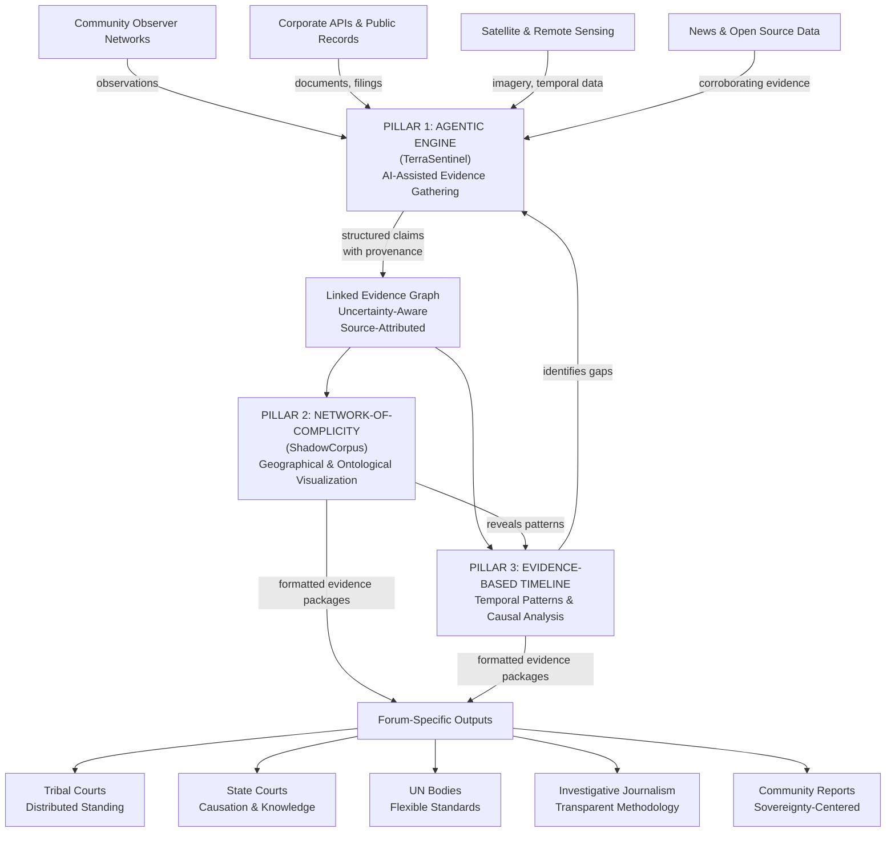

# Counterstack: An Architecture for Climate Rights Accountability

**A Proposal for Justice-Oriented Evidence Architecture**

---

## PART I: PROBLEM & PROMISE

### The Hook

> We have excellent climate justice theory and brave frontline communities. What we lack is the **infrastructure that connects investigation to law, and community testimony to court-ready evidence**. Not a product. Not a platform. A commons stack—an intentional, justice-oriented apparatus built on **protocol logic, not platform logic**.

---

### The Core Problem

Climate and infrastructure violence operates across multiple scales and temporalities:
- **Fast violence** (deportations, police raids, facility seizures) is operationalized with precision
- **Slow violence** (aquifer depletion, e-waste exposure, soil contamination) is externalized, pushed downstream to communities with no power to refuse
- **Structural violence** (liability caps, jurisdictional fragmentation, classification regimes) is naturalized—treated as inevitable features of "how systems work"
- **Extractive violence** (mineral supply chains, energy infrastructure, data economies) is disavowed—rendered invisible, costs pushed offshore

### The Accountability Gap

**Data infrastructure alone does not produce justice.** Visibility without forum, without standing, without power rebalancing, produces spectacle. We need something different.

---

## PART II: OUR APPROACH — DESIGN CONSTRAINTS AS STRATEGY

Rather than solving the broken legal system, we design *within* its constraints. Different forums recognize different forms of standing, evidence, and remedy. We build infrastructure that adapts evidence to multiple accountability pathways simultaneously.

### Design Constraint 1: Temporal Asymmetry

**The Problem:** Legal forums operate on fast/present timescales. Environmental harm is slow/cumulative. These temporalities don't align.
- Court discovery windows: 2-5 years
- Aquifer depletion: 20-30 years
- Climate tipping points: decades
- Harm recognition: often 10+ years after causation

**Our Design Strategy:** Build evidence infrastructure that can represent:
- Long-duration harm (continuous harm with episodic legal markers)
- Multiple temporal scales simultaneously (incident + phase + structural pattern)
- Retroactive recognition (impact occurs but is only recognized later)
- Temporal patterns that establish negligence and knowledge, not just causation

**Evidence Architecture Response:** Pillar 3 (Evidence-based Timeline) enforces temporal depth. Can query "show all harm effects spanning 30+ years" and refuse to collapse slow violence into single incidents.

---

### Design Constraint 2: Standing Doctrine Pluralism

**The Reality:** Standing varies dramatically by jurisdiction and is expanding but unevenly.

| Jurisdiction                          | Individual + Direct Harm | Distributed/Future Harm | Ecosystem Standing  | Realistic Timeline         |
| ------------------------------------- | ------------------------ | ----------------------- | ------------------- | -------------------------- |
| **US Federal Courts**                 | ✅ Required               | ❌ Narrow                | ❌ No                | 3-7 years                  |
| **Germany (Constitutional)**          | ✅ Yes                    | ✅ Future generations    | ⚠️ Proxy argument   | 2-3 years                  |
| **Philippines**                       | ✅ Yes                    | ✅ Emerging              | ✅ Rights-based      | 2-4 years                  |
| **Colombia/Peru**                     | ✅ Yes                    | ✅ Yes                   | ✅ Rights of Nature  | 2-4 years                  |
| **India (Supreme Court)**             | ✅ Yes                    | ✅ Yes                   | ✅ Ganges personhood | 2-5 years                  |
| **New Zealand**                       | ✅ Yes                    | ✅ Yes                   | ✅ Rivers as persons | 1-3 years                  |
| **Regional HR Courts (ECHR, IACTHR)** | ✅ Yes                    | ✅ Yes                   | ⚠️ Indirect         | 4-6 years, 3-5 years       |
| **UN Bodies**                         | ✅ Civil society          | ✅ Yes                   | ✅ Yes               | 2 years (per 5-year cycle) |

**Our Design Strategy:** Rather than changing standing doctrine (impossible), we generate evidence packages calibrated to each standing framework.
- Same harms, different legal vocabularies
- Community standing: emphasis on distributed harm + testimony
- State court standing: emphasis on individual causation + knowledge
- Ecosystem standing (where viable): emphasis on ecological monitoring + temporal pattern
- This multiplicity is strategic, not a limitation

**Evidence Architecture Response:** Pillar 2 (Network-of-Complicity) and Pillar 3 (Timeline) produce outputs formatted for different standing doctrines. Same evidence, different narratives.

---

### Design Constraint 3: Remedy Frameworks (What Courts Can Actually Award)

**Reparative Remedies** (restoration, return, rebuilding)
- ✅ **Viable in:** LatAm courts (Colombia, Peru, Ecuador), Indian courts, ECHR, IACTHR
- ✅ **Can award:** Restoration orders, damages, territorial rights recognition, management mandates
- 📊 **Timeline:** 2-4 years litigation
- **Example:** Colombian Constitutional Court ordering Atrato River restoration; Peru awarding land rights

**Preventive Remedies** (moratoriums, no-build zones, refusal to integrate)
- ✅ **Viable in:** EU courts (precautionary principle), India, LatAm, emerging in US
- ✅ **Can award:** Injunctions, permit denial, mandatory environmental review, licensing conditions
- 📊 **Timeline:** 1-3 years (faster than damages)
- **Example:** German Federal Court climate law requiring binding emissions targets

**Abolitionist Remedies** (dismantle infrastructure, end contracts, shut down facilities)
- ⚠️ **Status:** ASPIRATIONAL—framing our political horizon, not a deliverable litigation outcome
- ❌ **Courts will not order:** Infrastructure dismantling, abolition of ICE/data centers, structural system change
- ✅ **This is achieved through:** Policy pressure, reparations frameworks, movement strategy, refusal authority
- **Our role:** Document the evidence and conditions making abolition necessary. Create the case for why current structures must change.

**Our Design Strategy:** We produce evidence for reparative + preventive remedies NOW. We name abolitionist horizon as political work, not legal work. Honest framing prevents overselling.

---

### Design Constraint 4: Authority & Decentralization

**The Problem:** Accountability that depends on state authorization is accountability the state can revoke or redirect.

**Our Design Strategy:** Build infrastructure that enables multiple accountability pathways, not all state-dependent:

1. **State/Legal Accountability:** Courts, regulatory bodies (our focus for Tier 1 forums)
2. **Community Accountability:** Indigenous sovereignty, territorial authority, refusal (our focus for Tier 3)
3. **Global Accountability:** UN bodies, human rights mechanisms, reparations frameworks (our focus for Tier 2)

Each pathway has different evidence standards, timeline expectations, and remedy scope. We don't privilege state accountability; we recognize it as one of several paths.

**Evidence Architecture Response:** Pillar 1 (Agentic Engine) produces evidence. Pillars 2 & 3 format it for multiple authorities simultaneously. Protocol logic (not platform) means communities maintain control of their own data.

---

## PART III: TARGET FORUMS & EVIDENCE REQUIREMENTS

### Tier 1: Domestic & Regional Courts (Enforceable Accountability)

**Where climate standing is actually expanding:**

| Forum | Standing Doctrine | Evidence Standard | Court-Ready Evidence Types | Timeline | Realistic Remedies |
|---|---|---|---|---|---|
| **Germany (Constitutional Court)** | Constitutional duty to climate; future generations; youth | High (expert qualification, methodology transparent) | Climate science + national emissions data + forecasting models | 2-3 yrs | Binding emissions targets; policy mandates |
| **Philippines (Supreme Court)** | Human rights + future generations (expanding) | Medium-high (flexible but documented) | Impact projections + generational equity analysis + climate attribution | 2-4 yrs | Rights recognition; adaptation mandates |
| **India (Supreme Court)** | Right to life + PIL; Ganges as legal entity | Medium (PIL accepts broad evidence) | Water quality data + ecological monitoring + contamination evidence | 2-5 yrs | Restoration orders; corporate liability |
| **Colombia (Constitutional Court)** | Rights of Nature (Atrato River model) | Medium (accepts OSINT if documented) | Satellite imagery + ecosystem monitoring + supply chain analysis | 2-4 yrs | Restoration; territorial protection |
| **Peru (Constitutional/Superior Courts)** | Indigenous rights + environmental rights | Medium | Agronomic data + satellite + indigenous testimony | 2-4 yrs | Restoration; damages; license revocation |
| **New Zealand (Courts)** | Rivers as legal persons (Te Awa Tupuranga) | Medium (flexible) | Ecological monitoring + OSINT + expert testimony | 1-3 yrs | Management mandates; restoration |

**Evidence is NOT court-ready in:**
- US Federal Courts (standing narrow; Daubert standard strict; 10+ year timeline)
- UK Courts (evidentiary thresholds high; common law hearsay rules strict)

---

### Tier 2: Regional Human Rights Courts (Precedent-Setting Accountability)

| Forum | Standing | Evidence Standard | Timeline | Outcomes |
|---|---|---|---|---|
| **ECHR** | Broad (life, family, property harmed by climate) | Medium ("plausible" sufficient; hearsay accepted) | 4-6 years | Binding state liability; mandatory policy change |
| **Inter-American Court (IACTHR)** | Broad + Indigenous/collective rights | Medium-flexible | 3-5 years | Binding decisions; reparations; state obligations |
| **African Court** | Right to satisfactory environment (developing) | Medium-flexible | 4-7 years | Declaration of rights; state accountability |

---

### Tier 3: UN Bodies & Treaty Mechanisms (Agenda-Setting Accountability)

| Forum | Standing | Evidence Standard | Timeline | Outcomes |
|---|---|---|---|---|
| **UNFCCC Loss & Damage** | Civil society input; flexible | Low (narrative + data welcome) | 1-2 years per cycle | Reparations frameworks; policy shifts |
| **UN Human Rights Bodies** | Individual petition + thematic reporting | Medium (flexible; OSINT acceptable) | 1-3 years | Fact-finding reports; member state pressure |
| **Paris Agreement Reviews** | National communications; civil society | Medium (flexible) | 2 years per 5-year cycle | Policy pressure; adaptation mandates |

---

## PART IV: OSINT RELIABILITY & GUARDRAILS

**We use AI-assisted OSINT. We also acknowledge its real limitations.**

### Known OSINT Failure Modes

#### 1. Deepfakes & Synthetic Media (AI-Generated Footage)
- **Risk:** LLMs can generate videos indistinguishable from real footage. Detection tools fail at scale.
- **Impact:** If visual evidence (facility photos, satellite imagery) is poisoned with synthetic content, entire narratives collapse.
- **Our guardrail:** Any visual evidence for legal proceedings undergoes forensic authentication by human expert. Automated detection is unreliable.

#### 2. LLM Hallucination (False Citations)
- **Risk:** LLMs produce false citations at 50-82% rates depending on model and corpus.
- **Impact:** If Pillar 1 synthesizes evidence via LLM, false citations render claims useless in court.
- **Our guardrail:** Citation tracing (every claim links to exact source passage). 100% human editorial review of LLM output before legal use.

#### 3. Source Spoofing & Coordinated Deception
- **Risk:** Adversaries deploy AI-generated personas, cloned accounts, fabricated documents designed to exploit analyst pattern-recognition biases.
- **Impact:** Shell companies with false identities can be cited in multiple reports before detection.
- **Our guardrail:** Adversarial verification (assign someone to disprove each narrative). Confirmation bias mitigation through devil's advocate review.

### What OSINT Can & Cannot Do

**OSINT IS Tractable For:**
- Large-scale infrastructure (refineries, LNG terminals, mining sites) via satellite imagery
- Corporate registration networks (beneficial ownership chains) with verification
- Shipping routes (maritime commodities) via AIS data + corroboration
- Personnel networks (board members, cross-company connections)

**OSINT CANNOT Realistically Address:**
- Final-consumer attribution (no traceability mechanism exists)
- Informal supply chains (no digital record; requires on-ground access)
- Black-market chains (intentionally unrecorded)
- Intentional transshipment obscuration (shell companies designed to hide origin)
- Conflict minerals (requires customs validation + on-ground sourcing verification)

### Working Examples We Reference

- **Bellingcat Justice & Accountability Unit:** Publishes methodology transparently; maintains chain of custody; conducts mock trials against legal standards
- **Forensic Architecture:** Combines satellite imagery with on-ground verification and first-hand testimony; produces 3D evidence
- **Amazon Litigation:** 700+ Brazilian deforestation judgments using satellite + expert testimony; establishes satellite as admissible evidence type

---

## PART V: THE COUNTERSTACK — THREE INTEGRATED PILLARS

We propose an integrated stack of three pillars that operationalize the design constraints above.

### Architecture Overview



---

### Pillar 1: Agentic Engine (TerraSentinel)

![[TerraSentinel.png]]

**What it does:** AI-assisted harvesting and structuring of evidence across jurisdictions and source types.

**Prototype:** TerraSentinel
- Designed for **scaling** (harvest evidence at continental or sectoral scale)
- Designed for **deep investigation** (drill into specific supply chains, corporate networks, jurisdictional entanglements)
- Dual-mode operation: broad pattern-finding OR targeted attribution

**How it works:**
1. **Signal Ingestion** — Documents from: corporate filings (SEC), satellite feeds (Copernicus/Maxar), customs/trade data, news archives, regulatory databases, community reports
2. **Deduplication & Cleaning** — LLM-assisted but human-validated entity recognition across jurisdictions and languages
3. **Entity Linking** — Multiple mentions of same actor unified; beneficial ownership chains traced
4. **Relationship Mapping** — Supply chain dependencies, regulatory exemptions, personnel networks identified
5. **Claim Extraction** — From text to structured assertions: "Corporation X owns facility Y in jurisdiction Z"
6. **Confidence Weighting** — Each claim marked: high (multiple corroborating sources), medium (single source, cross-checked), low (preliminary)

**Output Format:**
```json
{
  "claim_id": "unique_identifier",
  "assertion": "Entity X connected to Y via Z",
  "source_documents": ["SEC filing #1", "satellite image #2", "news article #3"],
  "evidence_type": ["corporate_filing", "satellite_imagery", "testimony"],
  "confidence": 0.87,
  "provenance": ["source_url", "retrieval_date", "human_verifier_ID"],
  "adverse_info": "Alternative interpretation or contradicting evidence",
  "forum_readiness": ["tribal_court", "UN", "journalism"],
  "temporal_window": "2005-2023"
}
```

**Scaling vs. Depth Trade-off:**
- **Scale mode:** Harvest patterns across 10,000 facilities in a supply chain sector. Identify hotspots of liability. Feed to policy makers.
- **Depth mode:** Focus on one corporate network across 4 jurisdictions. Build complete beneficial ownership chain. Feed to litigators.

**Adversarial Hardening:**
- ✅ Citation tracing (every claim links to source document)
- ✅ Human verification gates (LLM output is research material, not final evidence)
- ✅ Adversarial review (devil's advocate questions every narrative)
- ✅ Local expert pairs (embedded linguistic, cultural, archival expertise)

#### Evidence Synthesis as Must
---

### Pillar 2: Network-of-Complicity (ShadowCorpus)

![[complicity_network.png]]
![[Map_complicity.png]]

**What it does:** Visualize relational and ontological networks—not just spatial relationships.

**Prototype:** ShadowCorpus
- Maps beneficial ownership chains, supply chain dependencies, regulatory exemptions, financial flows, personnel networks
- Visualizes **dark matter** (known gaps, hidden relationships, intentional opacity)
- Allows query-driven exploration: "show all entities in jurisdiction X" or "trace ownership backward from harm site"

**Data Model:**

Entity types tracked:
- Corporation, Subsidiary, Shell company, Individual (beneficial owner)
- Government agency, Facility, Geographic location, Ecological system

Relationship types tracked:
- OWNS (beneficial ownership)
- SUPPLIES (supply chain)
- EXEMPTED_FROM (regulatory escape)
- PAYS (financial flow)
- MANAGES (governance/control)
- GOVERNS (jurisdiction/authority)
- HARMS (material impact)
- MONITORS (oversight or lack thereof)

Attributes per relationship:
- Confidence level (how certain is this link?)
- Source documentation (which evidence proves it?)
- Temporal dimension (when did this relationship exist?)
- Jurisdictional context (which laws govern?)

**Visualization Approach:**

For small networks (< 100 entities): Force-directed graph (node-link)
For medium networks (100-1000): Hierarchical layout with clustering
For large networks (1000+): Strategic sampling + focus + context views

**Dark Matter Representation:**
- **Explicit gaps:** Dashed lines marked "beneficial ownership unknown"
- **Known obscuration:** Shell company nodes flagged "true beneficial owner untraced"
- **Jurisdictional gaps:** "No registry in jurisdiction X—relationship unverifiable"
- **Temporal gaps:** "Records destroyed 2010-2013"

Gaps are searchable so investigators can prioritize further research.

**Ontological Layer (Non-Spatial Relationships):**

The visualization layers:
- **Causal:** X decision produced Y harm
- **Structural:** X is part of the infrastructure enabling Y
- **Legal:** X is liable for Y under regime Z
- **Epistemic:** X knew/should have known about Y
- **Moral:** X is complicit in Y
- **Relational:** X and Y share supply chain/board/financing connections

Different courts recognize different ontologies. The visualization allows querying by legal framework.

---

### Pillar 3: Evidence-Based Timeline (Telegram, RAG System)

**What it does:** Represent harm across temporal scales and causation across jurisdictions. Scraping and Watchdog
![[WatchDog.jpg]]

![[QuickRag.jpg]]
**Event Schema:**
```json
{
  "event_id": "unique",
  "event_type": ["incident", "decision", "knowledge_moment", "phase", "absence"],
  "date_range": {
    "start": "ISO_date",
    "end": "ISO_date",
    "certainty": "exact | approximate | unknown"
  },
  "actors": [{"entity_id": "...", "role": "decision_maker | negligent_party | ..."}],
  "harm_affected": [
    {"population": "indigenous_community_X"},
    {"ecosystem": "aquifer_Y"},
    {"jurisdiction": "jurisdiction_Z"}
  ],
  "evidence_type": ["satellite", "testimony", "document", "data"],
  "sources": ["source_doc_1", "source_doc_2"],
  "conflict_phase": ["extraction", "externalization", "denial", "blame_shifting"],
  "legal_relevance": [
    {"forum": "Colombian_court", "claim_type": "negligence", "evidence_weight": 0.92},
    {"forum": "UN_bodies", "claim_type": "reparations_case", "evidence_weight": 0.95}
  ],
  "uncertainty": 0.1
}
```

**Temporal Handling:**

- **Disputed dating:** Events show confidence ranges. Users see uncertainty.
- **Continuous vs. episodic:** Aquifer depletion (continuous 2000-2020) shown as phase with legal markers (inspections, complaints) as sub-events
- **Retroactive recognition:** Impact occurs but is recognized later—timeline backfills with both dates
- **Causal inference:** Marked by source type: direct (witness), correlational (temporal proximity + mechanism), inferred (pattern + expert judgment). Confidence visible.

**Authority Weighting by Forum:**

In state courts: Legal testimony > corporate documents > OSINT > community testimony > ecological data

In tribal courts: Community testimony = ecosystem data > legal testimony > OSINT

In UN bodies: All sources equal; narrative diversity valued

In investigative journalism: Source corroboration > number of sources > institutional authority

Users filter timeline by weightings appropriate to their forum.

---

## PART VI: INTEGRATED EXAMPLE — HOW THE STACK WORKS

### Case: Water Rights, Mining, and Institutional Negligence

**Setup:** A mining company's subsidiary owns a water treatment plant in a region where two Indigenous nations claim water rights. Standard accountability fails because:
- Subsidiaries shield parent company from liability
- Water rights span jurisdictions with conflicting legal regimes
- Harm is slow (aquifer depletion over 20 years), not acute
- Knowledge of risk is distributed across departments and countries

**Pillar 1 (Agentic Engine) — Evidence Gathering:**

TerraSentinel harvests:
- 15,000 corporate documents spanning 4 jurisdictions (SEC filings, subsidiary registrations, permit applications, internal emails obtained via FOIA)
- 200 regulatory decisions showing: permits issued without adequate environmental review, scientific warnings ignored, health complaints dismissed
- Satellite imagery of aquifer indicators (vegetation stress, land subsidence patterns) 2005-2023
- Customs records showing water extraction rates increasing 300% over 18 years

Output: 47 structured claims with high confidence:
1. Parent company controls subsidiary (beneficial ownership chain traced)
2. Parent company knew about aquifer risk (email chain 2008: scientist → parent company CEO)
3. Risk was downplayed in regulatory filings (internal memo vs. public statement comparison)
4. Subsidiary was restructured after risk became public (2019 restructuring) to reduce parent liability

**Pillar 2 (Network-of-Complicity) — Visualization:**

ShadowCorpus shows:
- Water system: aquifer → treatment plant → mining facility → community wells (geographic layer)
- Ownership chains: parent corp → subsidiary → shell company (dark matter: beneficial owner is offshore entity, identified via regulatory filings but actual person unknown)
- Two liability pathways: (a) through subsidiary actions, (b) through parent-company knowledge and inaction
- Regulatory exemptions: permits issued under pre-2010 environmental standards, grandfather clauses apply
- Personnel network: board member X sits on parent company; same person advises regulator Y
- Timeline markers visible on the network: 2005 permits issued, 2008 warnings, 2015 health complaints, 2019 restructuring

**Pillar 3 (Timeline) — Causal Pattern:**

Evidence-based chronology:
```
2005: Permits issued without adequate environmental review
      → Evidence: regulatory file shows rejection of proposed baseline aquifer study
      → Causation: regulatory negligence established

2008: Environmental scientist warns of aquifer risk in published research
      → Evidence: paper + email thread showing CEO received it
      → Knowledge moment: parent company knew

2008-2015: Company continues extraction at authorized rates despite warning
      → Evidence: extraction permits renewed; no adaptation to risk
      → Negligence: knowledge + inaction

2015: Community health complaints filed with regulator
      → Evidence: medical records + regulatory complaint file
      → Causation: harm is now documented

2019: Subsidiary restructured; parent company increases distance
      → Evidence: corporate restructuring documents + financial transactions
      → Intent: evidence of intentional obscuration of liability

Overall pattern: 14-year arc from knowledge → inaction → harm → institutional obscuration
```

**Outcome — Forum-Specific Accountability:**

**For Colombian courts (expanding standing):**
- Standing granted to Indigenous plaintiffs under rights-of-nature doctrine
- Evidence type: Temporal pattern (knowledge + negligence + harm over 14 years) + ecological impact
- Likely remedy: Restoration order; damages; corporate liability; territorial protection

**For UN Loss & Damage reparations assessments:**
- Evidence feeds reparations case: X indigenous community was harmed; corporation knew; parent company profited
- Likely outcome: Recognition in reparations frameworks; pressure for bilateral compensation

**For investigative journalists:**
- Supply chain narrative is publishable: "Corporate Water Grab: How mining subsidiary drained aquifer while parent company looked away"
- Evidence transparency allows reproduction; methodology documented; sources attributed
- Likely outcome: Public pressure; regulatory scrutiny; shareholder pressure on parent company

---

## PART VII: WHAT THIS ACTUALLY DELIVERS

1. **Proposes architecture** for accountability across multiple scales and temporalities of violence
2. **Produces transferable methodology** for investigating networks of complicity across jurisdictions—useful for communities, activists, lawyers, regulators, journalists
3. **Generates evidence packages** formatted for identified forums where accountability is legally and politically possible
4. **Documents limits and risks** of OSINT approaches; names temporal misalignments and structural impediments
5. **Maps material conditions** (supply chains, energy, water, minerals) as the substrate enabling violence
6. **Shifts frame** from "build a system" to "what conditions make accountability possible?"

---

## PART VIII: DELIVERABLES & SUSTAINABILITY

### Field Manual
Not a protocol to be followed, but a template for adaptation. Communities modify it; modifications are documented as partnership-specific knowledge. Useful for OSINT communities, investigative journalists, legal teams.

### Community Investigation Toolkit
Specific to each partnership; non-transferable without consent. Allows communities (and their legal allies) to:
- Deploy TerraSentinel for their own investigations
- Generate ShadowCorpus visualizations of local supply chains
- Build timelines of harm relevant to their jurisdictions

### Workshops & Training
With regulatory bodies, legal organizations, community networks. Focuses on:
- How to generate court-ready evidence using the stack
- How to query for forum-specific evidence (tribal court ≠ state court ≠ UN body)
- How to document and maintain chains of custody
- How to avoid common OSINT pitfalls

### Protocol Logic (Not Platform)
Sustainability requires decentralization. The data schema, visualization ontologies, and timeline event structures are open. Communities can implement independently. Growth happens through protocol adoption, not platform lock-in.

---

## PART IX: NEXT PHASES

### Phase 1: Pilot Implementation (2024-2025)
- Test with 2-3 target jurisdictions (e.g., Colombia, Peru, Philippines)
- Build evidence packages for real cases
- Test against actual legal requirements (coordinate with courts/legal partners)
- Refine TerraSentinel and ShadowCorpus based on real evidence
- Document what works; what fails; what requires on-ground investigation

### Phase 2: Scaling & Validation (2025-2026)
- Expand to 5-8 geographies
- Coordinate with legal partners in each jurisdiction
- Establish what evidence standards each forum actually accepts
- Begin protocol standardization (open schemas for evidence claims, timeline events, visualization ontologies)

### Phase 3: Sustainability & Governance (2026+)
- Protocol maintenance (who decides if schemas evolve?)
- Community stewardship (move from Climate Rights to community governance)
- Integration with legal/activist networks
- Ongoing evidence pipeline (how does the system keep collecting evidence after the project ends?)

---

## PART X: KEY QUESTIONS FOR THE CONSORTIUM

1. **Forum specificity:** Which courts/forums should we prioritize in pilot phase? Which regions have legal partners ready to test evidence?

2. **Community integration:** How do we ensure Community Observer Networks are genuinely sovereign, not extractive? What consent frameworks do you propose?

3. **Operationalization:** For the prototypes (TerraSentinel, ShadowCorpus), what specific case would you want to test first? What evidence does your jurisdiction need?

4. **Governance:** As we move toward protocol logic, who governs the schemas? Should this be a consortium decision? Community-led? Decentralized?

5. **Timeline:** What's your commitment horizon? 2 years? 5 years? Ongoing? This shapes how we design for sustainability.

---

## APPENDIX: READINESS CHECKLIST

What we're bringing to the consortium:
- ✅ Hook and problem framing (exceptional; differentiated from other "tech for justice" projects)
- ✅ Design constraints clearly articulated (temporal, standing, remedy, authority)
- ✅ Forum viability matrix (5-8 specific courts with realistic evidence standards and timeline expectations)
- ✅ OSINT guardrails (known risks + mitigations + working references)
- ✅ Three-pillar architecture (conceptually integrated; two prototypes in development)
- ✅ Concrete case example (mining/water scenario walks through all three pillars)
- ⚠️ Architecture diagram (provided; can be refined to Excalidraw if needed for presentation)
- ⚠️ Detailed pillar specifications (available in supplementary technical docs; can be presented deeper if needed)
- ⚠️ Community integration specifics (designed; needs consortium input on consent frameworks)
- ⚠️ Protocol governance (vision clear; operational decisions await consortium input)

---

**Questions? Feedback? Suggestions for next phase?**
